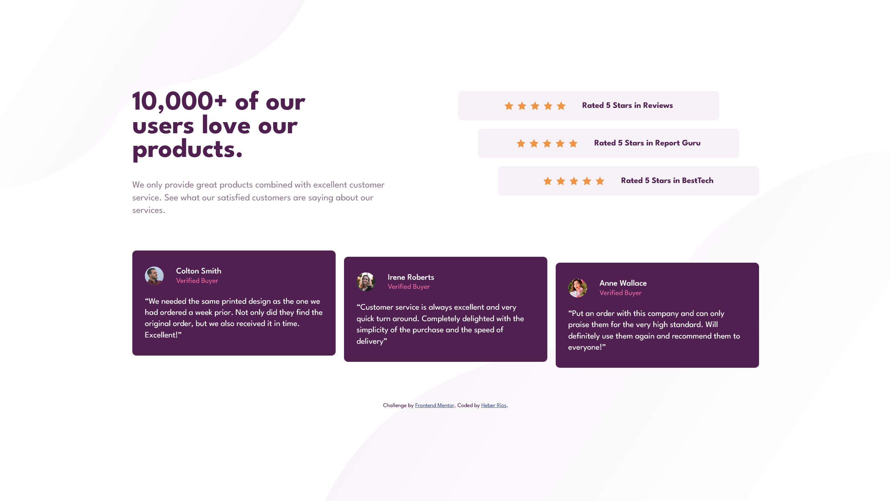
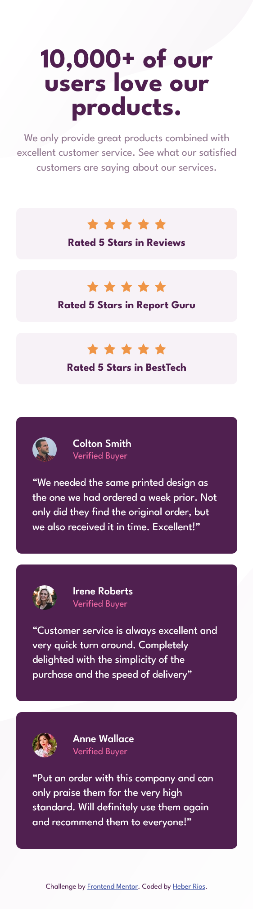

# Frontend Mentor - Social proof section solution

This is a solution to the [Social proof section challenge on Frontend Mentor](https://www.frontendmentor.io/challenges/social-proof-section-6e0qTv_bA).

## Table of contents

-   [Overview](#overview)
    -   [The challenge](#the-challenge)
    -   [Screenshot](#screenshot)
    -   [Links](#links)
-   [My process](#my-process)
    -   [Built with](#built-with)
    -   [What I learned](#what-i-learned)
    -   [Continued development](#continued-development)
    -   [Useful resources](#useful-resources)
-   [Author](#author)
-   [Acknowledgments](#acknowledgments)

## Overview

### The challenge

Users should be able to:

-   View the optimal layout for the site depending on their device's screen size

### Screenshot

-   Desktop design 
-   Mobile design 

### Links

-   [Solution URL](https://www.frontendmentor.io/solutions/social-proof-section-iJAev2u9lt)
-   [Live Site URL](https://heberrios.github.io/social-proof-section/)

## My process

### Built with

-   Semantic HTML5 markup
-   CSS custom properties
-   CSS Flexbox
-   Mobile-first workflow

### What I learned

The use of percentage units, to have even component dimensions.

### Continued development

Have a better understanding of semantic HTML and fluid typography.

Have better website layout building sense.

### Useful resources

-   [Why use rem instead of px](https://www.youtube.com/watch?v=xCSw6bPXZks) - This taught me
    a new best practice for responsive design.

-   [Use of clamp](https://www.youtube.com/watch?v=erqRw3E-vn4&t=202s) - This is an amazing article which helped me understand CSS clamp better. I'd recommend it to anyone still learning this concept.

## Author

-   Frontend Mentor - [@HeberRios](https://www.frontendmentor.io/profile/HeberRios)

## Acknowledgments

-   Frontend Mentor - [@JEWebDev](https://www.frontendmentor.io/profile/JEWebDev)
